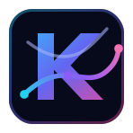

<p align="center">
  
</p>

<h1 align="center">kinodb</h1>

<p align="center">
  <strong>Robot trajectory database for fast, queryable, cross-format training data.</strong>
</p>

<p align="center">
  <a href="https://shaswat2001.github.io/kinodb/">Documentation</a> ·
  <a href="#quick-start">Quick Start</a> ·
  <a href="#benchmarks">Benchmarks</a> ·
  <a href="#why-kinodb">Why kinodb?</a> ·
  <a href="#status">Status</a>
</p>

---

kinodb turns robotics datasets into one indexed `.kdb` file. Ingest HDF5, LeRobot, or RLDS once, then query episodes with KQL, mix datasets by weight, validate data, and train through a single Rust/Python data path.

```bash
cargo build --release

# Create a small synthetic trajectory database.
target/release/kino create-test demo.kdb -n 20 --frames 50 --compress 85

# Inspect and query it.
target/release/kino info demo.kdb
target/release/kino schema demo.kdb
target/release/kino query demo.kdb "success = true AND num_frames > 25"
```

## Why kinodb?

Robot learning has a data layer problem. Models are becoming general, but datasets are still split across HDF5, Parquet, TFRecord, raw folders, and lab-specific loaders. That fragmentation shows up as slow dataloaders, memory-heavy conversions, duplicated dataset variants, fragile benchmark scripts, and custom glue every time a team wants to mix data sources.

kinodb is an episode-first database layer for that mess:

| Need | kinodb answer |
| --- | --- |
| One data path | Convert HDF5, LeRobot, and RLDS into the same `.kdb` layout |
| Fast random access | Memory-mapped reader plus end-of-file episode index |
| Metadata filters | KQL queries like `success = true AND task CONTAINS 'drawer'` |
| Dataset mixtures | Weighted sampling across many `.kdb` files |
| Training bridge | Python bindings, NumPy arrays, PyTorch helpers, and gRPC serving |
| Auditability | CLI schema, validation, benchmark, merge, query, and export commands |

## Supported Formats

| Source | Status | Notes |
| --- | --- | --- |
| robomimic / LIBERO HDF5 | Supported | Reads `data/demo_*` groups, actions, rewards, dones, observations, and camera images |
| LeRobot Parquet | Supported | Handles v2/v3 metadata, tasks, action/state list columns, and image struct payloads |
| RLDS / TFRecord | Supported | Manual TFRecord parser; no TensorFlow runtime dependency |
| `.kdb` mixtures | Supported | Weighted sources through CLI, Rust, Python, and server paths |
| gRPC serving | Supported | Remote batch serving for training workers |

## Quick Start

Build the CLI:

```bash
cargo build --release
export PATH="$PWD/target/release:$PATH"
```

Create and inspect a database:

```bash
kino create-test demo.kdb -n 20 --frames 50
kino info demo.kdb
kino schema demo.kdb
kino validate demo.kdb
```

Ingest real data:

```bash
# HDF5: robomimic, LIBERO, DROID-style files.
kino ingest path/to/data.hdf5 \
  --format hdf5 \
  --output data.kdb \
  --embodiment franka \
  --task "open the drawer" \
  --fps 20.0

# LeRobot directory.
kino ingest path/to/lerobot_dataset \
  --format lerobot \
  --output pusht.kdb \
  --max-episodes 100

# RLDS / TFRecord directory.
kino ingest path/to/rlds_dataset \
  --format rlds \
  --output bridge.kdb \
  --embodiment widowx
```

Read from Python after building the bindings:

```bash
cd crates/kinodb-py
maturin develop --release
cd ../..
```

```python
import kinodb

db = kinodb.open("demo.kdb")
print(db.summary())

episode = db.read_episode(0)
print(episode["actions"].shape)
print(episode["states"].shape)
```

## Benchmarks

Latest launch experiment highlights:

| Result | Number |
| --- | ---: |
| PushT image CNN/MLP training | 6.6-6.8x end-to-end |
| LIBERO spatial CNN/MLP training | 7.1-7.7x end-to-end |
| ViT training runs | 2.2-2.4x end-to-end |
| 50K episode open time | 1.2ms |
| 50K sequential read | 1.26s |
| 50K KQL scan | 31.7ms |
| Mixed-source loader code | 26 native LOC to 8 kinodb LOC |
| State-only 1K episode storage | 4.52 MB |

The speedup shrinks when model compute dominates the training step. That is expected: kinodb accelerates the data path, not the model math. Full benchmark tables live in the docs:

- [Training Pipeline](https://shaswat2001.github.io/kinodb/benchmarks/training/)
- [IO Performance](https://shaswat2001.github.io/kinodb/benchmarks/io/)
- [Correctness](https://shaswat2001.github.io/kinodb/benchmarks/correctness/)

## CLI

```text
kino <COMMAND>

Commands:
  create-test  Generate sample .kdb data
  ingest       Import HDF5, LeRobot, or RLDS into .kdb
  info         Show database summary
  schema       Print file layout and episode schema
  validate     Check consistency and corruption risks
  query        Filter episodes with KQL
  mix          Build weighted dataset mixtures
  merge        Merge .kdb files, optionally with a KQL filter
  export       Export to standard formats
  bench        Run local synthetic benchmarks
```

## Documentation

The full documentation is an Astro Starlight site in [`kinodb-docs/`](kinodb-docs/).

```bash
cd kinodb-docs
npm install
npm run dev
```

Local preview:

```text
http://127.0.0.1:4321/kinodb/
```

Public docs:

```text
https://shaswat2001.github.io/kinodb/
```

## Architecture

`.kdb` is an embedded binary trajectory format:

```text
┌──────────────────────────┐
│ FileHeader               │  magic, version, episode count, frame count
├──────────────────────────┤
│ Episode 0 metadata       │  task, embodiment, fps, success, reward
│ Episode 0 actions/state  │  packed f32 arrays
│ Episode 0 images         │  optional image payloads
├──────────────────────────┤
│ Episode 1 ...            │
├──────────────────────────┤
│ Episode Index            │  byte offsets and lengths for O(1) lookup
└──────────────────────────┘
```

Workspace layout:

```text
crates/
  kinodb-core/    storage engine, reader, writer, KQL, mixtures
  kinodb-ingest/  HDF5, LeRobot, and RLDS importers
  kinodb-cli/     kino command-line interface
  kinodb-serve/   gRPC serving layer
  kinodb-py/      Python bindings, built separately with maturin
```

## Status

Implemented:

- `.kdb` reader/writer with memory-mapped reads;
- HDF5, LeRobot, and RLDS ingestion;
- KQL metadata filters;
- CLI commands for info, schema, validate, query, mix, merge, export, and bench;
- Python bindings and PyTorch-facing helpers;
- gRPC server and Python client.

Roadmap:

- published wheels and packaged CLI releases;
- lazy/window-level frame sampling;
- raw compressed-image return path and faster decode options;
- more complete video segment indexing;
- shared-memory serving for high-throughput single-node training.

## License

MIT. See [LICENSE](LICENSE).
